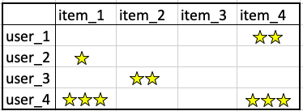
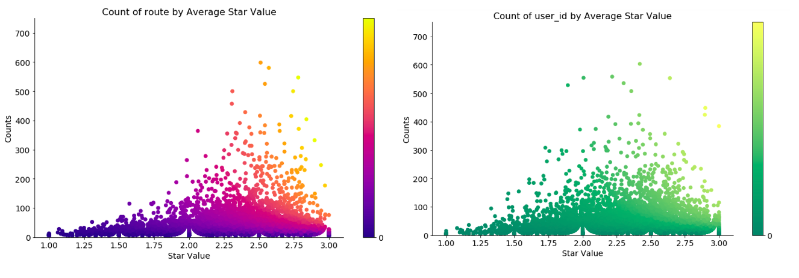
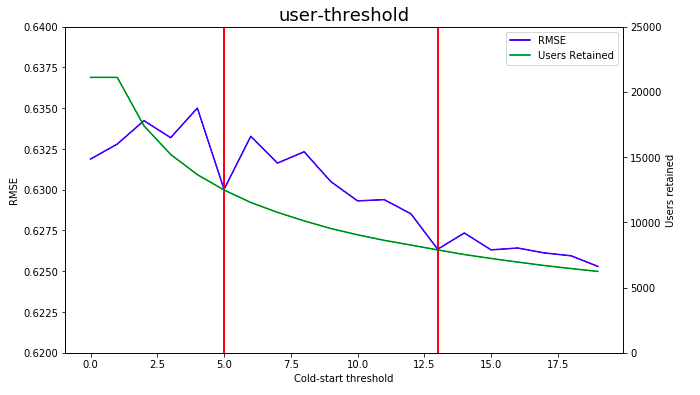

# International Rock Climbing Recommendation System

*The sport of rock climbing has been steadily increasing in popularity. From 2012-2017, the IBISWorld estimates that from average annual growth for the indoor climbing wall industry was [3.9% in the USA](https://www.ibisworld.com/industry-trends/specialized-market-research-reports/consumer-goods-services/sports-recreation/indoor-climbing-walls.html).  In 2015, it ranked 17th out of 111 out of the most popular sports in the United States ( Physical Activity Council and PHIT America). Yet, even with this growth in popularity, most of the international rock climbing websites still lack a rock climbing recommendation system. In this project, I will create a recommendation system for the 8a.nu website that will help climbers identify some unique international climbing objectives.*

## 1. Data

8a.nu is one the world’s largest international rock climbing websites. With over 4 million entries of climbs and ratings, this Kaggle webscraping project is a sufficient size to develop a good predictor model. To view the 8a.nu website, the original Kaggle four SQLite tables created by David Cohen, or the import report using the Kaggle API click on the links below:

> * [8a.nu website](https://www.8a.nu/)

> * [Kaggle Dataset](https://www.kaggle.com/dcohen21/8anu-climbing-logbook)

> * [Data Import Report](https://drive.google.com/open?id=1S4io5Nvz0lcnri_Lz9Mpa_TwLNeoSzGb)

## 2. Method

There are three main types of recommenders used in practice today:

1. **Content-based filter:** Recommending future items to the user that have similar innate features with previously "liked" items. Basically, content-based relies on similarities between features of the items & needs good item profiles to function properly.

2. **Collaborative-based filter:** Recommending products based on a similar user that has already rated the product. Collaborative filtering relies on information from similar users, and it is important to have a large explicit user rating  base (doesn't work well for new customer bases).

3. **Hybrid Method:** Leverages both content & collaborative basded filtering. Typically when a new user comes into the recommender, the content-bsaed recommendation takes place. Then after interacting with the items a couple of times, the collaborative/ user based recommendation system will be utilized.

**WINNER:User-based collaborative filtering system** 

I choose to work with a User-based collaborative filtering system. This made the most sense because half of the 4 million user-entered climbs had an explicit rating of how many stars the user would rate the climb. Unfortuntely, the data did not have very detailed "item features". Every rock climbing route had an area, a difficulty grade, and a style of climbing (roped or none). This would not have been enough data to provide an accurate content-based recommendation. In the future, I would love to experiment using a hybrid system to help solve the problem of the cold-start-threshold.

## 3. Data Cleaning 

[Data Cleaning Report](https://drive.google.com/open?id=195wcooDtT2XhfpRXREWmLovm8XZPNymy)

In a collaborative-filtering system there are only three columns that matter to apply the machine learning algorithms: the user, the item, and the explicit rating (see the example matrix above). I also had to clean & normalize all the reference information (location, difficulty grade, etc) to the route so that my user could get a userful and informative recommendation.

* **Problem 1:** This dataset is all user-entered information. There are a couple drop down options, but for the most part the user is able to completely make-up, or list something incorrectly. **Solution:** after normalizing & cleaning all the columns, I created a three-tier groupby system that I could then take the mode of each entry and fill in the column with that mode. For example: a route listed 12 times had the country Greece associated with it 11 times, but one person listed it in the USA. By imputing multiple columns with the mode (after the three tiered groupby), I was able to increase the accuracy of my dataset

* **Problem 2:** Being this is an international rock climbing website, the names of the rock climbing routes were differing based on if the user enters accent marks or not. **Solution:** normalize all names to the ascii standards. 

* **Problem 3:** Spelling issues with the route name. For example: if there was a route named "red rocks canyon" it could be spelled "red rock", "red rocks", "red canyon" etc. **Solution:** at first I was hopeful and tried two different phonetic spelling algorithms (soundex & double metahpone). However, both of these proved to be too aggressive in their grouping and somtimes would group together up to 20 different individual routes as the same item! My final solution was to create an accurate filter for route names. The logic being that if up to x number of users all entered that *exact same* route name, the chances were good that it was an actual route spelled correctly. I played around with 4 different filters and kept these until I could test their prediction accruacy in the ML portion. I found the greatest prediction accuracy came from the dataset that filtered out any routes listed less than 6 times.

## 4. EDA

[EDA Report](https://colab.research.google.com/drive/14AKVsyXy7yJSxBjmEBFyz7kEX7e9ioM_)

* The star-rating distributions all checked out to be normal. It is very common with explicit ratings to see a diminished number of low ratings.

## 5. Algorithms & Machine Learning

[ML Notebook](https://colab.research.google.com/drive/1kAlvwwJnGcdCAJD8oFokT3gtJF2UnyZP)

I chose to work with the Python [surprise library scikit] (http://surpriselib.com/) for training my recommendation system. I tested all four different filtered datasets on the 11 different alogorithms provided, and everytime the Single Value Decompositin++ (SVD++) algorithm performed the best. It should be noted that this algorithm, although the most accurate is also the most computationally expensive, and that should be taken into account if this were to go into production.

**NOTE:** I choose RMSE as the accuracy metric over mean absolute error(MAE) because the errors are squared before they are averaged which gives the RMSE a higher weight to large errors. Thus, the RMSE is useful when large errors are undesirable. The smaller the RMSE, the more accurate the prediction because the RMSE takes the square root of the residual errors of the line of best fit.

**WINNER: SVD++ Algorithm**
This algorithm is an improved version of the SVD algorithm that Simon Funk popularized in the million dollar Netflix competition that also takes into account implicit ratings (yj). Using stochastic gradient descent (SGD), parameters are learned using the regularized squared error objective.

## 6. Which Dataset to choose?

After choosing the SVD++ algorithm, I tested the accuracy of all four different filtered datasets. The datset which filtered out any route names occurring less than 6 times performed the most accurate predictions. Thus, it was chosen to be the dataset I trained on.

* All of the dataframes displayed discrepencies with the 1 star ratings(This is to be expected due to the inherent skewed positive ratings). Also, the one star ratings are not imperative to this project's goal. It is more important that the 1 star ratings are different enough to be filtered out of the top ten routes recommended to users. 
* Notice the 3-star rating has a fat bulge at the top of the "violin" which indicates its predicting 3-star ratings for some of the true 3-star routes. This was not as promenant in the other dataframes
* The 1-star rating also has a fatter tail than the other datasets displayed

## 7. Coldstart Threshold

**Coldstart Threshold**: There is a problem when only using collaborative based filtering: *what to recommend to new users with no, or very little prior data?* Remember, we already set our cold start threshold for the routes by choosing the dataset that filtered out any route occuring less than 6 times. Now, let investigate where to put the threshold for users.

* Increasing the user threshold to 5 would increase the RMSE by .005 & would loose approximately 40% of the data.
* Increasing the user threshold to 13 would increase the RMSE by .0075 & would loose approximately 60% of the data
* If there were a larger increase in the RMSE (>= .01) I would trade my users data for this improvement. However, these improvements are too minuscule to give up 40%-60% of my data to train on. Instead, I vote to keep some of these outliers to help the model train, and will focus on fine tuning my parameters using gridsearch to improve the RMSE

*It is my hypothesis that the initial filtering of the routes is what affected the RMSE of the users* 

## 7. Predictions

## 8. Future Improvements

## 9. Credits

